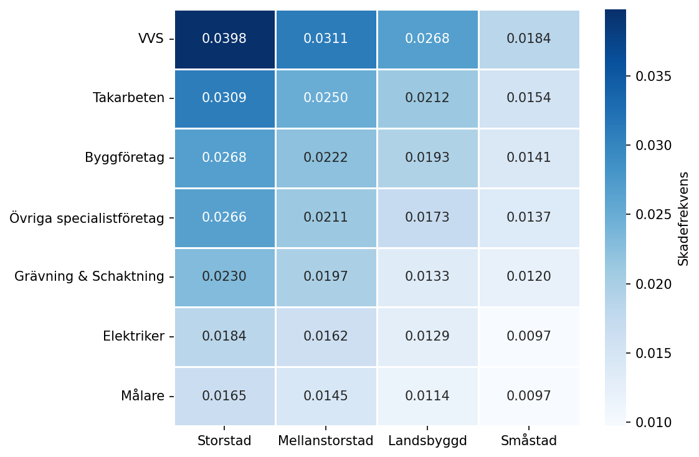

# Skadefrekvensanalys av Entreprenadförsäkring

## 1. Inledning

I skadeförsäkring ska premien spegla kundens förväntade risk, vilket kan delas upp i skadefrekvens (hur ofta skador inträffar) och skadekostnad (hur dyrt det blir per skada). Den här rapporten analyserar frekvenskomponenten — startpunkten för prissättning. Uppdragsgivaren Länsförsäkringar vill veta vilka faktorer som driver skadefrekvensen i sin entreprenadportfölj och prediktera framtida skadeutfall som underlag för premiesättning.

Datamaterialet består av försäkringsavtal 2021–2024 (träning) och en separat testportfölj för 2025, med information om verksamhetstyp, geografiskt område, omsättning, försäkringsbelopp, självrisk, antal skador och exponeringstid. Cirka 98 procent av avtalen saknar skador, vilket gör att modellerna måste vara anpassade för gles räknedata och hantera exponeringstid korrekt.

Syftet är att bygga, jämföra och tolka modeller för skadefrekvens samt förutsäga skadeutfallet 2025. Huvudfrågan är:

> Hur väl kan skadeantal förutsägas med hjälp av kund-, verksamhets- och försäkringsdata, och ger en maskininlärningsmodell (XGBoost) tillräckligt mervärde jämfört med en tolkbar statistisk modell (Poisson-GLM)?

Tre delfrågor undersöks:

- Vilka faktorer driver skadefrekvensen i portföljen?
- Ger XGBoost bättre prediktiv förmåga än Poisson-GLM?
- Vilken modell bör föredras när både träffsäkerhet och tolkbarhet vägs in, och vilka osäkerheter behöver beaktas?

Rapportens röda tråd är avvägningen mellan tolkbarhet och prediktiv förmåga. Poisson-GLM ger transparenta koefficienter som direkt kan översättas till premiejusteringar, vilket är värdefullt för pris- och segmenteringsbeslut. XGBoost är mer flexibel och kan fånga icke-linjära mönster, men fungerar mer som en black box som är svår att förklara mot kund och integrera i prissättningssystem. Den centrala frågan är därför om XGBoosts eventuella prediktiva mervärde motiverar den minskade tolkbarheten.

## 2. Ämnesbeskrivning

En *ratingfaktor* är en variabel som förklarar systematiska riskskillnader mellan kunder och används för att differentiera premier. I företagsförsäkring är verksamhetstyp, geografiskt område och ekonomisk storlek klassiska ratingfaktorer eftersom de fångar skillnader i verksamhetens art och volym som påverkar sannolikheten för skada.

Entreprenadförsäkring är en utpräglat heterogen portfölj. Den omfattar allt från ensamma hantverkare till stora byggkonsortier — företag som kan tillhöra samma branschkategori men ändå ha helt olika skadebild. En genomsnittlig portföljpremie skulle därför systematiskt missbedöma både låg- och högriskkunder, och empirisk identifiering av ratingfaktorer är central för att översätta heterogeniteten till en differentierad premie. För att modellera skadefrekvens i denna typ av portfölj har Poisson-GLM länge fungerat som aktuariell standard.

## 3. Metod

### 3.1 Data

Projektet bygger på försäkringsdata uppdelad i en träningsfil för 2021–2024 (1 033 386 rader, 19 730 skador) och en testfil för 2025 (291 649 rader, 5 520 skador). Varje rad representerar ett försäkringskontrakt med information om `Verksamhet`, `GeografisktOmrade`, exponeringstiden `Duration` (andel av ett år), `AntalSkador` samt `Forsakringsbelopp`, `Omsattning` och `Sjalvrisk`. Datakontrollen genomfördes med avseende på saknade värden, datatyper, kategorinivåer och variabelområden — resultatet redovisas i 4.1. Inga rensningar, imputeringar eller trunkeringar bedömdes nödvändiga.

### 3.2 Valideringslogik

För att efterlikna en verklig prognossituation delades träningsfilen tidsmässigt: kandidatmodellerna tränades på 2021–2023 och utvärderades på valideringsåret 2024. Slutmodellen tränades sedan om på hela 2021–2024 inför prediktionen för 2025, som reserverades för slutlig utvärdering. Att basera modellvalet på 2025 hade gett *look-ahead bias* och en systematiskt för optimistisk utvärdering.

### 3.3 Deskriptiv analys

Den deskriptiva analysen undersökte skadefördelning, segmentvisa skadefrekvenser för `Verksamhet`, `GeografisktOmrade` och `Ar`, samt fördelningar och samvariation mellan de ekonomiska variablerna. Decilanalys och korrelation användes för att avgöra vilka ekonomiska variabler som tillförde unik information. Analysen fungerade som ett första filter inför modellbygget i 3.4: variabler med tydliga skillnader i skadefrekvens togs vidare som kandidater, medan starkt överlappande variabler hanterades direkt i variabelvalet.

### 3.4 Poisson-GLM

Skadeantal är *count-data* — icke-negativa heltal — och modellerades därför med en Poisson-GLM. Vanlig linjär regression är inte lämplig eftersom den kan ge negativa prediktioner. Med en *log-länk* modelleras logaritmen av väntevärdet som en linjär kombination av riskfaktorerna, vilket ger positiva prediktioner och multiplikativa effekter på skadefrekvensen. `Duration` behandlas som exponering och inkluderas som en *offset* `log(Duration)` vars koefficient är låst till ett. Modellstrukturen blir:

`log(E[AntalSkador]) = log(Duration) + modellens riskfaktorer`

Tre kärnvariabler togs in baserat på den deskriptiva analysen: `Verksamhet` och `GeografisktOmrade` som kategoriska huvudeffekter samt `log(Omsattning)` för att fånga kundstorlek. Logaritmen användes eftersom omsättningen är kraftigt högerskev och möjliggör tolkning per relativ förändring. `Forsakringsbelopp` och `Sjalvrisk` exkluderades eftersom de fångar samma underliggande storlekseffekt som omsättning, vilket hade orsakat *multikollinearitet* — instabila och svårtolkade koefficienter när starkt korrelerade variabler ingår tillsammans.

Fyra modeller specificerades sekventiellt: M0 (intercept only), M1 (M0 + `Verksamhet` + `GeografisktOmrade`), M2 (M1 + `log(Omsattning)`) och M3 (M2 + `Ar`). M3 ingick endast som tidsvariations-kontroll; en kategorisk årseffekt kan inte extrapoleras till 2025. Modellerna jämfördes med AIC och valideringsdeviance — ett Poissonanpassat felmått beräknat på 2024 där lägre värden indikerar bättre passform. M2 valdes om både AIC och valideringsdeviance förbättrades tydligt jämfört med M1. Poissonantagandet `var(Y) = E(Y)` kontrollerades med Pearson χ²/frihetsgrader; ett värde klart över ett hade motiverat negativ binomial.

### 3.5 XGBoost

XGBoost användes som challenger till Poisson-GLM. Modellen är en *gradient boosting*-metod där flera små beslutsträd byggs sekventiellt och varje nytt träd försöker korrigera tidigare träds fel; den slutliga prediktionen är summan av trädens bidrag. XGBoost fångar icke-linjäriteter och interaktioner utan explicit specifikation och fungerar därför som kontroll av om GLM missar viktiga mönster.

För rättvis jämförelse mot GLM M2 användes samma kärnvariabler (`Verksamhet`, `GeografisktOmrade`, `log(Omsattning)`), samma tidsbaserade validering och `Duration` som offset via `base_margin = log(Duration)`. Objektivfunktionen var `count:poisson`. Sex konfigurationer testades med varierande träddjup och inlärningstakt; antal träd bestämdes med *early stopping* på valideringsåret 2024. Den bästa konfigurationen blev `max_depth = 3`, `learning_rate = 0,10` och 232 träd.

### 3.6 Modelljämförelse

Modellerna jämfördes först på valideringsåret 2024; testportföljen 2025 användes endast för den slutliga utvärderingen. Det primära måttet var Poisson deviance — det naturliga utvärderingsmåttet för count-data eftersom det är direkt relaterat till sannolikheten under Poissonmodellen. Som kompletterande mått användes RMSE, MAE, totalt observerat och predikterat skadeantal samt portföljfel i procent. Beslutsregeln var att XGBoost ersätter GLM M2 som huvudmodell endast om förbättringen är tydlig och konsekvent på både validerings- och testdatan; en marginell förbättring motiverar inte ett byte, eftersom GLM erbjuder direkt tolkbara koefficienter.

### 3.7 Osäkerhetsanalys

Osäkerhetsanalysens syfte var att kvantifiera hur säker GLM M2 är i sina prediktioner — både för enskilda rader och för hela portföljen. För varje predikterad skadefrekvens beräknades ett 95-procentigt konfidensintervall, smalare för vanliga kundprofiler och bredare för ovanliga. Relativ osäkerhet (intervallbredd / prediktion) användes för att jämföra mellan kunder. Den totala 2025-prediktionen fick också ett konfidensintervall. Hög osäkerhet drivs av små träningsceller (ovanliga kombinationer av `Verksamhet` och `GeografisktOmrade`), extrema omsättningsnivåer eller kort exponeringstid.

## 4. Resultat

### 4.1 Deskriptiv analys

**Skadefördelning.** Skadefrekvensen är 0,0214 i träning (19 730 skador på 924 039 exponeringsår) och 0,0212 i test, med 98,1 procent nollskador i båda filerna. Den nästan identiska frekvensen tyder på att portföljsammansättningen är stabil och att testfilen är representativ för träningsperioden.

**Verksamhet × geografi.** Skadefrekvensen varierar markant både mellan verksamheter och mellan geografiska områden (Figur 1). VVS har den högsta marginalfrekvensen (0,032 skador per exponerat år) och Målare den lägsta (0,014); Storstad är drygt dubbelt så skadebelagd som Småstad. Heatmappen visar dessutom att gradienterna huvudsakligen är additiva: VVS × Storstad ligger högst (0,040) och Målare × Småstad lägst (0,010), men ingen kombination avviker dramatiskt från vad rad- och kolumneffekterna förutsäger var för sig.

**Figur 1 — Skadefrekvens per Verksamhet × Geografiskt område (träning 2021–2024).** Mörkare nyans innebär högre skadefrekvens (skador per exponerat år).

**Tidsvariation.** Skadefrekvensen är stabil 2021–2024 med en variation på under 3 procentenheter (0,0205–0,0219) och utan tydlig monoton trend. Det motiverar att ingen explicit årseffekt inkluderas i slutmodellen.

**Ekonomiska variabler.** Decilanalys på `Omsattning` ger den starkaste och mest monotona gradienten (5,6× spridning från lägsta till högsta decil). `Forsakringsbelopp` visar en svagare gradient (3,2×) och korrelerar måttligt med `Omsattning` (r = 0,57 på log-skala), vilket skapar multikollinearitet om båda inkluderas. `Sjalvrisk` har enbart fyra distinkta nivåer och svagt samband med skadefrekvens. Fynden motiverar `Omsattning` som primär storleksvariabel i GLM. Korrelationsmatris och decilfigur återfinns i appendix.

### 4.2 Poisson-GLM

#### 4.2.1 Modellval och kontroll

**Tabell 1 — Jämförelse av modellkandidater (träning 2021–2023, validering 2024).** Lägre AIC och lägre valideringsdeviance indikerar bättre modell.

| Modell | Beskrivning | AIC | Valideringsdeviance |
|---|---|---:|---:|
| M0 | Intercept only | 141 086 | 41 500 |
| M1 | Verksamhet + Geografi | 139 723 | 41 200 |
| M2 | M1 + log(Omsättning) | 136 971 | 41 002 |
| M3 | M2 + Ar (kategorisk) | 136 969 | — |

M2 valdes som slutmodell. AIC-förbättringen från M1 till M2 är 2 752 enheter, vilket är klart praktiskt och statistiskt meningsfullt. Steget M2 → M3 ger ΔAIC ≈ 2, försumbart, och en kategorisk årseffekt kan inte extrapoleras till 2025. Resultatet bekräftar att risken i portföljen drivs av verksamhet, geografi och omsättning snarare än av specifika kalenderår. M2 tränades sedan om på hela 2021–2024 inför prediktionen för 2025.

Pearson χ²/frihetsgrader för slutmodellen är 0,986. Poissonantagandet `var(Y) = E(Y)` håller väl och negativ binomial behövs inte. Den höga andelen nollskador (98 %) är en naturlig konsekvens av låga förväntade värden (λ ≈ 0,02), inte ett tecken på att en zero-inflated modell krävs.

#### 4.2.2 Slutmodell M2 — koefficienter

GLM-koefficienter skattas på log-skala. Genom att exponentiera en koefficient erhålls en *rate ratio* — en multiplikator som anger hur skadefrekvensen ändras relativt en referensnivå. En rate ratio på 1,46 betyder 46 procent högre förväntad skadefrekvens än referenskategorin, allt annat lika. Som referenskategorier används Byggföretag (`Verksamhet`) och Landsbyggd (`GeografisktOmrade`); för `log(Omsattning)` redovisas effekten per *fördubbling* av omsättningen.

**Tabell 2 — Rate ratios med 95 % konfidensintervall för slutmodell M2 (tränad på 2021–2024).**

| Variabel | Rate ratio | 95 % KI |
|---|---:|---|
| **Verksamhet** (ref: Byggföretag) | | |
| VVS | 1,432 | [1,372, 1,494] |
| Takarbeten | 1,135 | [1,067, 1,207] |
| Övriga specialistföretag | 0,970 | [0,932, 1,010] |
| Grävning & Schaktning | 0,855 | [0,808, 0,905] |
| Elektriker | 0,698 | [0,659, 0,738] |
| Målare | 0,637 | [0,601, 0,675] |
| **Geografi** (ref: Landsbyggd) | | |
| Storstad | 1,461 | [1,387, 1,540] |
| Mellanstorstad | 1,203 | [1,140, 1,270] |
| Småstad | 0,757 | [0,711, 0,806] |
| **Storlek** (per fördubbling) | | |
| log(Omsattning) | 1,358 | [1,345, 1,371] |

VVS har 43 procent högre skadefrekvens än Byggföretag och Målare 36 procent lägre — drygt dubbel skillnad mellan ytterligheterna. Storstad ligger 46 procent över Landsbyggd, och gradienten stiger monotont från Småstad → Landsbyggd → Mellanstorstad → Storstad. Varje fördubbling av omsättningen hänger samman med 36 procent högre skadefrekvens, utöver den exponering som `Duration` redan fångar. Konfidensintervallen är genomgående smala, vilket innebär att skillnaderna är statistiskt säkra. Övriga specialistföretag är den enda kategorin vars KI inkluderar 1, alltså inte säkerställt skild från Byggföretag.

#### 4.2.3 Utvärdering på testportfölj 2025

På 2025-portföljen predikterade GLM M2 totalt 5 581 skador mot 5 520 observerade — ett portföljfel på +1,1 procent. Aggregatkalibreringen är god. Per-segment-kalibreringen är ojämnare (Tabell 3 och 4):

**Tabell 3 — Observerat och predikterat skadeantal per verksamhet, testportfölj 2025.**

| Verksamhet | Observerat | Predikterat | Fel (%) |
|---|---:|---:|---:|
| VVS | 858 | 824 | −4,0 |
| Takarbeten | 353 | 328 | −7,0 |
| Byggföretag | 2 286 | 2 306 | +0,9 |
| Övriga specialistföretag | 908 | 957 | +5,4 |
| Grävning & Schaktning | 372 | 397 | +6,6 |
| Elektriker | 411 | 400 | −2,7 |
| Målare | 332 | 369 | +11,1 |

**Tabell 4 — Observerat och predikterat skadeantal per geografiskt område, testportfölj 2025.**

| Geografi | Observerat | Predikterat | Fel (%) |
|---|---:|---:|---:|
| Storstad | 2 746 | 2 726 | −0,7 |
| Mellanstorstad | 1 603 | 1 688 | +5,3 |
| Landsbyggd | 470 | 463 | −1,5 |
| Småstad | 701 | 704 | +0,4 |

VVS och Takarbeten underprediceras (4–7 %), Målare överprediceras med 11 procent. Geografiskt är Storstad och Småstad väl kalibrerade men Mellanstorstad överpredikeras med 5 procent. Aggregatfelet är litet eftersom över- och underprediktioner i hög grad kvittar; konsekvenserna av segmentmönstret diskuteras i 5.2.

### 4.3 XGBoost

XGBoost tränades enligt 3.5. De grunda konfigurationerna (träddjup 3) presterade bäst på 2024-valideringen, medan djupare träd (5, 8) gav högre deviance. Det tyder på att signalen i datan i huvudsak är additiv — komplexa interaktioner tillför lite utöver vad de enkla mönstren redan fångar. Den valda konfigurationen (`max_depth = 3`, `learning_rate = 0,10`, 232 träd) tränades om på hela 2021–2024 och utvärderades på testportföljen 2025: Poisson deviance 41 856 och 5 587 predikterade skador (+1,2 procents portföljfel).

Feature importance (gain) rangordnar `log(Omsattning)` (20,0) klart före `GeografisktOmrade` (8,3) och `Verksamhet` (6,5). XGBoost identifierar alltså samma drivare som GLM, vilket stärker förtroendet för GLM:s variabelval. Detaljerad tabell finns i appendix.

### 4.4 Modelljämförelse

**Tabell 5 — Modelljämförelse på testportfölj 2025.** Skillnad anges som XGBoost minus GLM; negativt deviance-värde betyder XGBoost-fördel.

| Mått | GLM M2 | XGBoost | Skillnad |
|---|---:|---:|---|
| Poisson deviance | 41 889 | 41 856 | −0,08 % |
| RMSE | 0,1374 | 0,1374 | ≈ 0 |
| MAE | 0,0371 | 0,0371 | ≈ 0 |
| Totalt predikterat | 5 581 | 5 587 | +6 |
| Portföljfel | +1,10 % | +1,22 % | +0,12 procentenheter |

På osedd data är XGBoosts deviance-fördel −0,08 procent. RMSE och MAE är identiska, och GLM har dessutom marginellt lägre portföljfel. Modellerna generaliserar likvärdigt. Valideringsåret 2024 visade samma mönster (se appendix).

Enligt beslutsregeln i 3.6 motiverar denna marginella skillnad inte ett byte av huvudmodell. GLM M2 rekommenderas; XGBoost fyller sin roll som challenger genom att bekräfta att datan inte innehåller starka icke-linjära mönster som GLM missar.

### 4.5 Osäkerhet i prediktioner

**Portföljnivå.** 2025-prognosen är 5 581 skador med 95 % KI [5 503, 5 659] — en relativ osäkerhet på 2,8 procent. Det observerade utfallet (5 520) ligger inom intervallet, vilket bekräftar att modellens kalibrering håller på portföljnivå.

**Radnivå.** Relativ osäkerhet varierar mellan 5,2 % och 18,7 % (median 9,2 %). De mest osäkra prediktionerna tillhör ovanliga kombinationer av verksamhet och geografi — exempelvis Takarbeten på Landsbyggd eller VVS i Småstad — och kunder med extrem omsättning. De minst osäkra tillhör stora välrepresenterade segment, som Byggföretag i Storstad med medianomsättning.

## 5. Analys

### 5.1 Riskmönstret som helhet

GLM M2 ger en sammanlagd spridning på cirka 3× mellan lägsta och högsta riskprofil — affärsmässigt stort och tillräckligt för att motivera differentierad premiesättning. Spridningen gäller dock *mellan* modellens segment: en kund i Byggföretag × Storstad med medianomsättning får en specifik prediktion, men *inom* det segmentet finns variation som modellen inte ser (säkerhetsrutiner, projektmix, kundspecifik historik). Storstadseffekten på 46 procent är dessutom effekten *givet verksamhet* — utan kontroll skulle den vara större, eftersom Storstad innehåller relativt mer VVS och färre Målare. Slutligen är samtliga effekter associationer i observationsdata: modellen visar att VVS-rader har högre skadefrekvens, inte att verksamhetstypen i sig orsakar skador.

### 5.2 Segmentkalibrering — där aggregatfelet inte räcker

Portföljfelet 2025 är +1,1 procent, vilket är bra för en portfölj av denna storlek. Men under aggregatet ligger en mer ojämn bild: per-verksamhet-felen sträcker sig från −7 procent (Takarbeten underpredicerad) till +11 procent (Målare överpredicerad), och Mellanstorstad överpredikeras med 5 procent (Tabell 3 och 4). Aggregatet stämmer eftersom över- och underprediktioner kvittar.

Detta är viktigt eftersom prissättningen sker per kund, inte per portfölj. En tariff som överprediskar Målare med 11 procent skulle systematiskt prissätta dessa kunder för högt och göra dem mindre konkurrenskraftiga, medan VVS-kunder med en 4 procents underprediktion skulle vara underprissatta i förhållande till faktisk risk. Jämn aggregatkalibrering är inte samma sak som rättvis individuell prissättning.

Tre potentiella förklaringar till segmentfelen är värda vidare arbete:

1. **Icke-additiva interaktioner** mellan verksamhet och geografi. Heatmappen i 4.1 visade att gradienterna i huvudsak är additiva, men avvikelser av storleksordningen 5–11 procent skulle kunna fångas av interaktionstermer.
2. **Oobserverade segmentdrivare** som inte finns i variabeluppsättningen — säkerhetskultur, projekttyp, finkornigare branschkod (SNI), kundspecifik skadehistorik.
3. **Temporal drift** mellan träningsperioden 2021–2024 och teståret 2025 som drabbar segmenten olika hårt.

Operationellt motiverar detta att modellen följs upp årligen mot faktiskt utfall — segmentfel är en mer känslig signal på modelldrift än portföljfelet.

### 5.3 Modellval: tolkbarhet mot prediktiv förmåga

XGBoost förbättrar Poisson deviance med 0,21 procent på 2024 och 0,08 procent på 2025 jämfört med GLM M2. RMSE, MAE och portföljfel är i praktiken identiska (Tabell 5). Skillnaden är för liten för att utgöra prediktivt mervärde.

Tre observationer stärker slutsatsen:

1. Bästa XGBoost-konfigurationen använder grunda träd (`max_depth = 3`), vilket tyder på att signalen i datan i huvudsak är additiv — precis det GLM antar.
2. Feature importance landar i samma rangordning som GLM. XGBoost hittar inga nya mönster.
3. GLM levererar rate ratios med konfidensintervall som kan översättas direkt till premiejusteringar; XGBoost saknar denna transparens.

GLM M2 rekommenderas som huvudmodell. XGBoost fyller en operativ roll som parallell challenger — om gapet mellan modellerna växer i framtida utfallsår signalerar det att additivitetsantagandet kan behöva omprövas.

### 5.4 Antaganden, DGP-stabilitet och giltighetsgränser

**Poisson-antagandet.** Dispersionskvoten 0,986 (4.2.1) bekräftar att `var(Y) = E(Y)` håller för slutmodellen. Marginalen är dock inte stor — ett enskilt händelseår med dispersion runt 1,1 räcker för att antagandet ska behöva omprövas och negativ binomial bli relevant. Att 98 procent av raderna har noll skador är en naturlig egenskap av låga förväntade värden, inte ett tecken på att en zero-inflated modell krävs.

**DGP-stabilitet och årsexkluderingen.** Att exkludera `Ar` ur slutmodellen och att anta stabil datagenererande process är två sidor av samma mynt. En modell utan tidskomponent har ingen mekanism att registrera att världen förändras mellan år — den antar implicit att de samband som gäller 2021–2024 även gäller 2025, justerat för portföljens sammansättning. Den lyckade 2024-valideringen utan `Ar` ger empiriskt stöd för antagandet under perioden 2021–2024, men garanterar det inte för 2025. Vid strukturella förändringar — inflation som ändrar skadebilden, ny lagstiftning, makroekonomiska skiften eller stora portföljförändringar — saknar modellen mekanism att registrera detta. Den fortsätter prediktera som om träningsperioden fortfarande gäller. Modellen är ett beslutsunderlag, inte en sanning, och prediktionen för 2025 bör tolkas med denna begränsning i åtanke.

**Reliabilitet och validitet.** Stor datamängd (>1 miljon rader) ger stabila skattningar med smala konfidensintervall, och nästan identisk skadefrekvens i träning (0,0214) och test (0,0212) tyder på stabil portföljstruktur. Den temporala valideringen är modellens viktigaste validitetsbevis: portföljfelet på +1,1 procent på en helt osedd 2025-portfölj är ett konkret stöd för att slutmodellen generaliserar. Den centrala validitetsbegränsningen är att tillgängliga variabler inte fångar alla riskdrivare; oobserverade faktorer som säkerhetsrutiner och projekttyp kan påverka frekvensen utan att synas i modellen.

## 6. Slutsats

Skadeantal i entreprenadportföljen kan förutsägas med god träffsäkerhet trots att 98 procent av avtalen saknar skador. Poisson-GLM M2, anpassad för just denna typ av gles räknedata, predikterade 5 581 skador för testportföljen 2025 mot 5 520 observerade — ett portföljfel på +1,1 procent. XGBoost gav marginellt bättre deviance men ingen praktiskt meningsfull förbättring.

**Riskfaktorer.** Tre variabler driver skadefrekvensen: verksamhet, geografi och omsättning. Tillsammans ger de cirka 3× spridning mellan lägsta och högsta riskprofil — tillräckligt för att motivera premiedifferentiering. Konkreta rate ratios redovisas i Tabell 2.

**Modellval.** GLM rekommenderas som huvudmodell eftersom koefficienterna översätts direkt till premiejusteringar och modellen är transparent och enkel att följa upp årligen. XGBoost rekommenderas som parallell challenger som larmar om prediktionsgapet växer — en signal om att GLM-antagandena börjar svikta.

**Begränsningar.** Resultaten är samband i observationsdata, inte orsakseffekter. Modellen skattar enbart skadefrekvens; full premieberäkning kräver en separat kostnadsmodell. Per-segment-felen är affärsmässigt relevanta även när aggregatfelet är litet, och stabilitetsantagandet 2021–2024 → 2025 kan brytas av strukturella förändringar som inflation eller ny lagstiftning, vilket modellen själv inte kan upptäcka.

**Vidare arbete.** Modellera skadekostnad för full premieberäkning, testa interaktioner mellan verksamhet och geografi för att fånga segmentfelen, samla in finkornigare ratingvariabler (SNI-kod, företagsålder, kundspecifik skadehistorik), och följ upp modellen årligen mot faktiskt utfall.

## 7. Appendix

### 7.1 Källkod

GitHub: <https://github.com/Berget1411/risk-analysis>

### 7.2 Korrelationsmatris för ekonomiska variabler (log-skala)

| Variabelpar | r |
|---|---:|
| Omsättning ↔ Försäkringsbelopp | 0,57 |
| Omsättning ↔ Självrisk | 0,45 |
| Försäkringsbelopp ↔ Självrisk | 0,26 |

### 7.3 XGBoost feature importance (gain)

| Variabel | Gain |
|---|---:|
| log(Omsattning) | 20,04 |
| GeografisktOmrade | 8,26 |
| Verksamhet | 6,46 |

### 7.4 Modelljämförelse på valideringsåret 2024

| Mått | GLM M2 | XGBoost | Skillnad |
|---|---:|---:|---|
| Poisson deviance | 41 002 | 40 918 | −0,21 % |
| RMSE | 0,1406 | 0,1406 | ≈ 0 |
| MAE | 0,0375 | 0,0375 | ≈ 0 |
| Totalt predikterat | 5 250 | 5 253 | +3 |
| Observerat | 5 446 | 5 446 | — |
| Portföljfel | −3,59 % | −3,55 % | +0,04 procentenheter |
